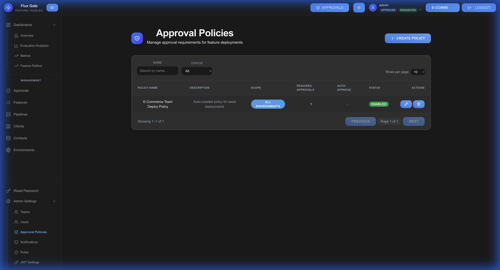
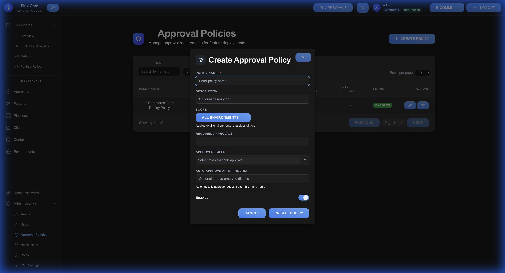
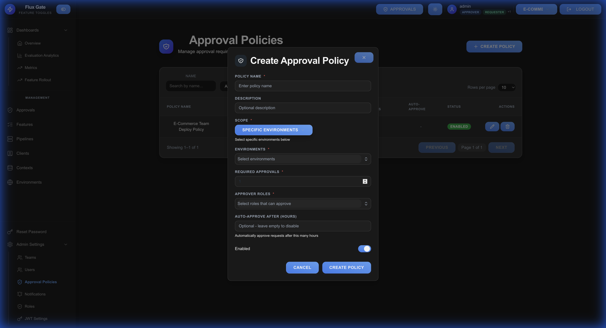
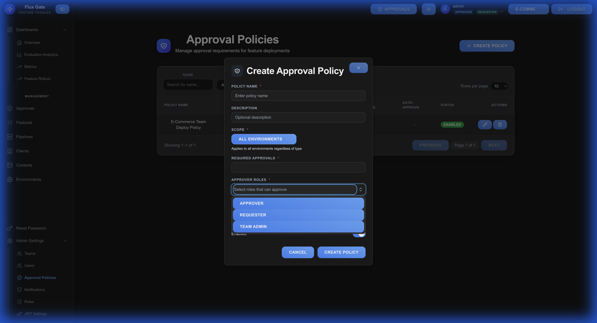

# Approval Policies

Approval policies define governance rules for feature flag changes, ensuring critical modifications are reviewed before deployment.

## Overview

Policies control who must approve changes, which environments require approval, and automatic timeout behaviors.



## Creating an Approval Policy

Navigate to **Settings** → **Approval Policies** and click **CREATE POLICY** to open the modal.



### Understanding the Modal Popup

The **Create Approval Policy** modal contains all configuration fields:

**Modal Header:**
- Title: "Create Approval Policy" with shield icon
- Close button (X) to cancel

**Form Fields:**

1. **POLICY NAME** (Required)
   - Unique identifier
   - Example: "Production Changes", "Critical Features"

2. **DESCRIPTION** (Optional)
   - Purpose and context
   - Documents policy rationale

3. **SCOPE** (Required)
   - Determines which environments require approval
   - Options:
     - **ALL ENVIRONMENTS**: Every environment
     - **PRODUCTION ONLY**:Only production
     - **SPECIFIC ENVIRONMENTS**: Select individual environments

4. **REQUIRED APPROVALS** (Required)
   - Number of approvals needed
   - Minimum: 1
   - Example: 1 for peer review, 2 for strict control

5. **APPROVER ROLES** (Required)
   - Multi-select roles authorized to approve
   - Available roles:
     - **Approver**: Dedicated approval authority
     - **Requester**: Peer review (can't approve own)
     - **Team Admin**: Administrative approval power

6. **AUTO-APPROVE AFTER (HOURS)** (Optional)
   - Hours until automatic approval
   - 0 = never auto-approve
   - Leave empty to disable

7. **Enabled** (Toggle)
   - Activate/deactivate policy
   - Default: Enabled

**Modal Footer:**
- **CANCEL**: Close without saving
- **CREATE POLICY**: Save and activate

## Policy Configuration Fields

| Field | Description | Options |
|-------|-------------|---------|
| **Policy Name** | Unique identifier | Required text input |
| **Description** | Purpose and context | Optional text area |
| **Scope** | Environments needing approval | All / Production Only / Specific |
| **Required Approvals** | Approval threshold | Integer (min: 1) |
| **Approver Roles** | Authorized roles | Multi-select dropdown |
| **Auto-approve After** | Timeout hours | Integer or 0/empty |
| **Enabled** | Policy active status | Toggle switch |

## Scope Options

### All Environments
Every feature change across all environments requires approval.

**Use Cases:**
- Highly regulated industries
- Strictest governance
- Maximum oversight

### Production Only
Only production environment changes require approval.

**Use Cases:**
- Balanced governance and velocity
- Most common configuration
- Fast dev/staging iteration

### Specific Environments
Select individual environments requiring approval.



**Use Cases:**
- Custom workflows
- Gradual governance rollout
- Environment-specific policies

## Approver Roles

Choose which user roles can approve requests.



| Role | Permissions | Use Case |
|------|-------------|----------|
| **Approver** | Dedicated approval authority | Engineering leads, release managers |
| **Requester** | Approve others' requests | Peer review workflows |
| **Team Admin** | Administrative power | Team leads, project managers |

**Multi-Role Selection:**
- Select multiple roles for flexibility
- Users with **any** selected role can approve
- Example: `Approver + Team Admin` allows either

## Auto-Approve Timeout

Configure automatic approval if no rejections occur within timeframe.

**Use Cases:**

**Urgent Fixes (2-4 hours):**
```
Auto-approve After: 2
```
Emergency changes during off-hours with audit trail.

**Standard Workflow (24-48 hours):**
```
Auto-approve After: 24
```
Balances governance with development velocity.

**Strict Governance (Never):**
```
Auto-approve After: 0
```
Always requires explicit human approval.

## Step-by-Step Creation

**Step 1**: Click **CREATE POLICY** on Approval Policies page

**Step 2**: Enter policy name
```
Example: "Production Approval Workflow"
```

**Step 3**: Add description (optional)
```
Example: "Requires engineering lead approval for production changes"
```

**Step 4**: Select scope
- Production-only: Most common
- All environments: Strictest
- Specific: Custom

**Step 5**: Set required approvals
```
1 = Peer review
2 = Dual approval
```

**Step 6**: Choose approver roles
- Peer review: "Requester" + "Approver"
- Admin-only: "Team Admin"
- Flexible: All roles

**Step 7**: Configure auto-approval (optional)
```
24 = Standard
2 = Urgent
0/empty = Never
```

**Step 8**: Toggle enabled status (default: ON)

**Step 9**: Click **CREATE POLICY**

## Policy Examples

### Example 1: Production-Only Peer Review

**Configuration:**
```
Policy Name: Production Changes
Scope: Production Only
Required Approvals: 1
Approver Roles: Requester, Approver
Auto-approve After: 0 (never)
```

**Workflow:**
- Developer A modifies production feature
- Developer B (Requester) or any Approver can approve
- Change applies once approved

---

### Example 2: Multi-Environment Strict Control

**Configuration:**
```
Policy Name: Critical Features
Scope: Production, Staging
Required Approvals: 2
Approver Roles: Team Admin, Approver
Auto-approve After: 24
```

**Workflow:**
- Change affects staging/production
- Requires 2 Team Admin or Approver approvals
- Auto-approves after 24 hours if not rejected

---

### Example 3: Emergency Change Protocol

**Configuration:**
```
Policy Name: Emergency Overrides
Scope: All Environments
Required Approvals: 1
Approver Roles: Team Admin
Auto-approve After: 2
```

**Workflow:**
- Critical bug fix needed immediately
- Team Admin reviews (or auto-approves in 2 hours)
- Maintains audit trail for urgent changes

## Best Practices

**Scope-Based Policies**: Use "Production Only" for balanced governance

**Realistic Timeouts**: Match auto-approval to team availability and time zones

**Multi-Role Approvers**: Include both Approver and Team Admin for flexibility

**Audit Regularly**: Review approval history and auto-approval usage

**Document Intent**: Use Description field to explain policy rationale

**Avoid Single Points of Failure**: Don't rely on single approver role

---

[← Approvals](Approvals) | [Home](Home) | [Next: Contexts →](Contexts)
