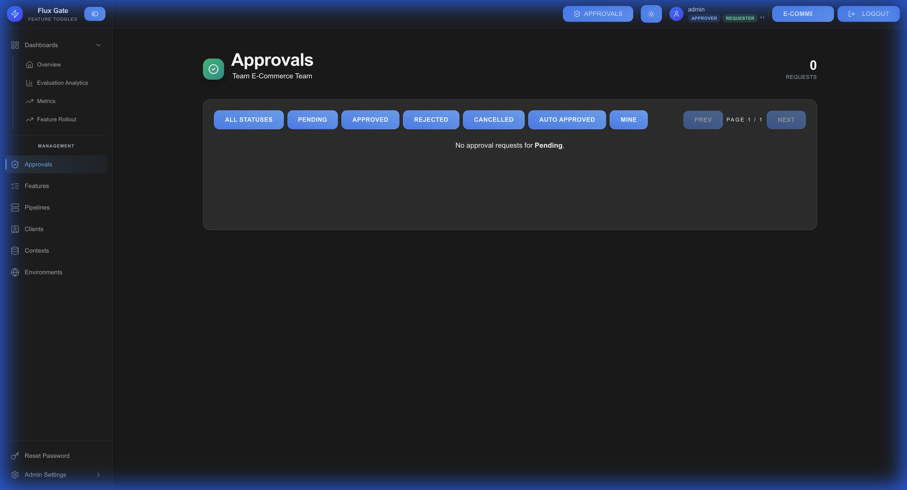

# Approvals

The approvals workflow ensures feature changes are reviewed before deployment, providing governance and quality control.

## Overview

When approval policies are configured, feature modifications require approval from authorized users before taking effect.

## Approval Workflow

### 1. Requester Submits Change

A user (Requester) modifies a feature:
- Creating new feature flags
- Updating targeting rules or variants
- Changing stage configuration
- Deleting features
- Promoting through pipelines

### 2. System Routes Request

The system evaluates active approval policies:
- Checks if change affects scoped environments
- Determines required number of approvals
- Identifies eligible approver roles
- Creates approval request

### 3. Notifications Sent

Eligible approvers receive notifications:
- In-app notifications
- Email alerts (if configured)
- Dashboard badge counters

### 4. Approvers Review

Approvers examine the request:
- View proposed changes
- Compare before/after configuration
- Check criteria and targeting rules
- Review variant allocations
- Assess risk and impact

### 5. Approval Decision

Approvers can:

**Approve**: Count toward required approvals
- Add optional comments
- Once required approvals met → change applies

**Reject**: Block the change
- Add rejection reason
- Notify requester
- Change discarded

**Comment**: Provide feedback without decision
- Request clarifications
- Suggest modifications

### 6. Change Application

**Approved**: Change deploys when threshold met
- Features updated immediately
- Edge servers sync via gRPC
- Audit trail created

**Rejected**: Change blocked
- Requester notified with reason
- Can modify and resubmit

**Auto-Approved**: Applied after timeout (if configured)
- Only if no rejections occurred
- Maintains audit trail

## Approval Types

### Feature Creation
Creating new feature flags

**Required Information:**
- Feature key, name, description
- Type (On/Off or Contextual)
- Initial variants and stages

### Feature Update
Modifying existing features

**Common Changes:**
- Targeting rule modifications
- Variant allocation adjustments
- Stage configuration updates
- Enable/disable toggle

### Feature Deletion
Removing feature flags

**Considerations:**
- Check for active evaluations
- Verify no production dependencies
- Archive before delete

### Environment Promotion
Promoting features through pipelines

**Validation:**
- Previous stage testing complete
- Metrics within acceptable ranges
- No blocking issues

### Stage Changes
Moving features between lifecycle stages

**Transitions:**
- Active → Deprecated
- Beta → Active
- Deprecated → Archived

## Viewing Approval Requests

### Pending Approvals

Navigate to **Approvals** page to see:

**Requests Awaiting Your Approval:**
- Feature name and type
- Requester name
- Change description
- Submission time
- Current approval count
- Required approval count

**Your Submitted Requests:**
- Pending approval status
- Current approvers
- Approval progress
- Estimated approval time

### Approval History

View past approvals to:
- Track governance compliance
- Audit feature changes
- Review decision rationale
- Analyze approval patterns

## User Roles

### Requester
- Submit feature changes
- View own request status
- Can approve **others'** requests (peer review)
- Cannot approve own requests

### Approver
- Dedicated approval authority
- Review and approve/reject requests
- Add detailed comments
- Track approval metrics

### Team Admin
- All Approver permissions
- Configure approval policies
- Manage users and roles
- Override approvals (if configured)

## Best Practices

**Review Thoroughly**: Examine all aspects of proposed changes

**Add Comments**: Document reasoning for approve/reject decisions

**Timely Reviews**: Respond to approval requests promptly

**Peer Review**: Enable Requester role for peer approval workflows

**Monitor Metrics**: Track approval times and bottlenecks

**Clear Policies**: Ensure team understands approval requirements

**Audit Regularly**: Review approval history for compliance

---

[← Environments](Environments) | [Home](Home) | [Next: Approval Policies →](Approval-Policies)
