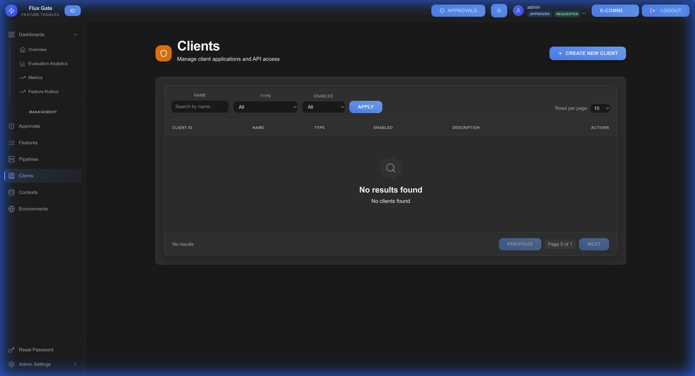

# Clients

Clients are SDK or API integrations that evaluate feature flags in your applications.

## Overview

Client applications connect to the FluxGate Edge Server to evaluate feature flags in real-time. Each client represents a specific application or service.



## Client Configuration

| Field | Description | Example |
|-------|-------------|---------|
| **Client ID** | Unique identifier | `mobile-app-ios` |
| **Name** | Display name | "iOS Mobile App" |
| **Description** | Purpose and context | "Production iOS application" |
| **API Key** | Authentication token | Auto-generated |
| **Environment** | Target environment | Production, Staging, Development |

## Creating a Client

1. Navigate to **Clients** → **Create Client**
2. Enter client details:
   - **Name**: Application name
   - **Description**: Purpose and context
   - **Environment**: Target environment
3. Click **CREATE**
4. **Copy API Key**: Save the generated API key securely

⚠️ **Important**: API keys are shown only once. Store them securely.

## SDK Integration

### Edge Server Endpoint

Client SDKs connect to the Edge Server:

```
http://localhost:8081
```

### Evaluation Request

Clients send evaluation requests with context:

```bash
curl -X POST http://localhost:8081/evaluate \
  -H "Content-Type: application/json" \
  -H "Authorization: Bearer YOUR_CLIENT_API_KEY" \
  -d '{
    "features": ["new-dashboard", "express-checkout"],
    "context": {
      "userId": "user_12345",
      "userTier": "pro",
      "country": "US"
    }
  }'
```

### Response Format

```json
{
  "new-dashboard": {
    "enabled": true,
    "variant": "variant-a",
    "reason": "RULE_MATCH"
  },
  "express-checkout": {
    "enabled": false,
    "variant": "control",
    "reason": "DEFAULT"
  }
}
```

## Authentication

Clients authenticate using API keys in the Authorization header:

```
Authorization: Bearer <CLIENT_API_KEY>
```

## Client Management

### Updating Clients

1. Navigate to client details
2. Modify name, description, or environment
3. Save changes

### Rotating API Keys

For security, periodically rotate client API keys:

1. Open client settings
2. Click **ROTATE API KEY**
3. Confirm rotation
4. Update applications with new key

### Deleting Clients

1. Ensure client is no longer in use
2. Navigate to client settings
3. Click **DELETE**
4. Confirm deletion

## Best Practices

**Descriptive Names**: Use clear client names (e.g., "iOS App - Production")

**Environment Mapping**: Create separate clients per environment

**Secure Keys**: Store API keys in environment variables or secret managers

**Rotate Regularly**: Periodically rotate API keys for security

**Monitor Usage**: Track evaluation metrics per client

**Clean Up**: Remove unused clients to maintain security

---

[← Contexts](Contexts) | [Home](Home) | [Next: Teams →](Teams)
