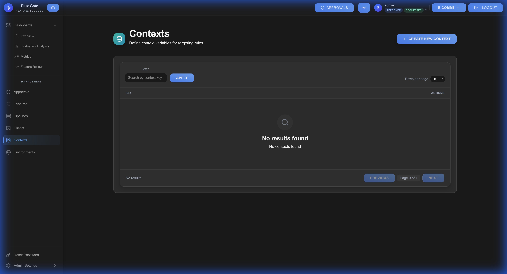

# Contexts

Contexts define the attributes used for feature flag targeting. They describe the properties available for creating criteria conditions.

## Overview

Context keys represent user or environment attributes that can be used in targeting rules. Common examples include user ID, country, device type, subscription tier, and app version.



## Context Attributes

### Standard Attributes

FluxGate supports common context attributes:

| Attribute | Type | Example | Use Case |
|-----------|------|---------|----------|
| `userId` | String | `"user_12345"` | User-specific features |
| `email` | String | `"user@example.com"` | Email domain targeting |
| `country` | String | `"US"` | Geographic targeting |
| `region` | String | `"us-west-2"` | Regional features |
| `deviceType` | String | `"mobile"` | Device-specific UI |
| `appVersion` | String | `"2.1.0"` | Version-based rollouts |
| `userTier` | String | `"premium"` | Subscription-based features |
| `age` | Number | `25` | Age-based targeting |
| `beta Tester` | Boolean | `true` | Beta program access |

### Custom Attributes

Define custom context keys specific to your application:

- `accountType`: Business vs personal accounts
- `industry`: Industry segmentation
- `companySize`: Small, medium, enterprise
- `experimentGroup`: A/B test cohorts
- `loginCount`: User engagement level

## Creating Context Keys

1. Navigate to **Contexts** → **Create Context**
2. Enter context details:
   - **Key**: Attribute name (e.g., `userTier`)
   - **Type**: STRING, NUMBER, BOOLEAN
   - **Description**: Purpose and usage
   - **Examples**: Sample values
3. Save the context

### Example Context

**Key**: `subscriptionTier`  
**Type**: STRING  
**Description**: User's subscription level  
**Examples**: `free`, `pro`, `enterprise`

## Using Contexts in Criteria

Contexts are referenced in criterion conditions:

**Example Condition:**
```
Context Key: userTier
Operator: IN
Value: ["pro", "enterprise"]
```

**Result**: Matches users with pro or enterprise subscriptions

## Context Structure in SDK

When evaluating features, provide context in evaluation requests:

```json
{
  "features": ["new-dashboard"],
  "context": {
    "userId": "user_12345",
    "email": "user@example.com",
    "country": "US",
    "userTier": "pro",
    "appVersion": "2.1.0",
    "deviceType": "mobile"
  }
}
```

## Best Practices

**Use Consistent Naming**: Follow camelCase (userId, userTier) or snake_case (user_id, user_tier)

**Document Thoroughly**: Add clear descriptions and examples for each context

**Validate Types**: Ensure context values match defined types (string, number, boolean)

**Limit Scope**: Only create contexts you'll actually use in targeting

**Standardize Across Teams**: Use common context keys organization-wide

**Version Attributes**: For evolving schemas, use versioned keys (e.g., `userProfileV2`)

## Common Patterns

### Geographic Targeting
```json
{
  "country": "US",
  "region": "us-west-2",
  "timezone": "America/Los_Angeles"
}
```

### User Segmentation
```json
{
  "userId": "user_12345",
  "userTier": "enterprise",
  "accountAge": 365,
  "loginCount": 150
}
```

### Device Targeting
```json
{
  "deviceType": "mobile",
  "os": "iOS",
  "appVersion": "2.1.0",
  "screenSize": "large"
}
```

### Experimentation
```json
{
  "experimentGroup": "cohort-A",
  "betaTester": true,
  "earlyAccess": true
}
```

---

[← Approval Policies](Approval-Policies) | [Home](Home) | [Next: Clients →](Clients)
