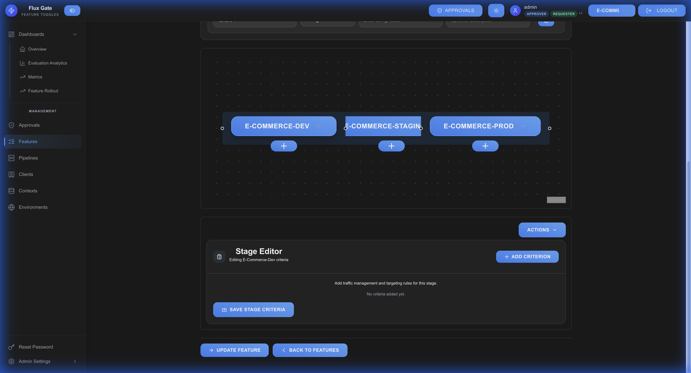
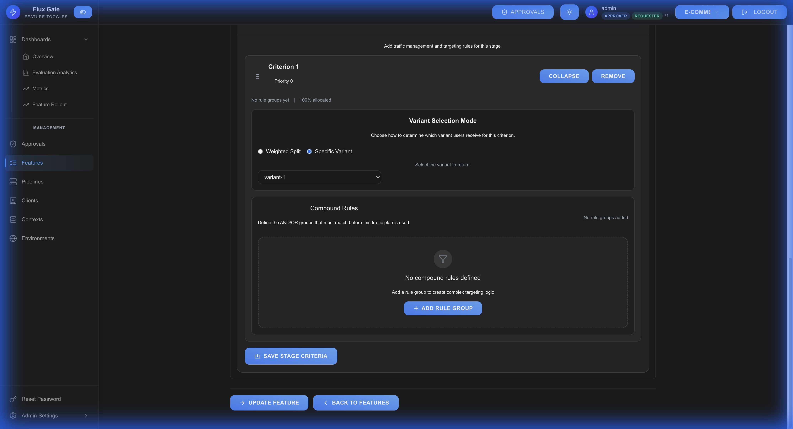
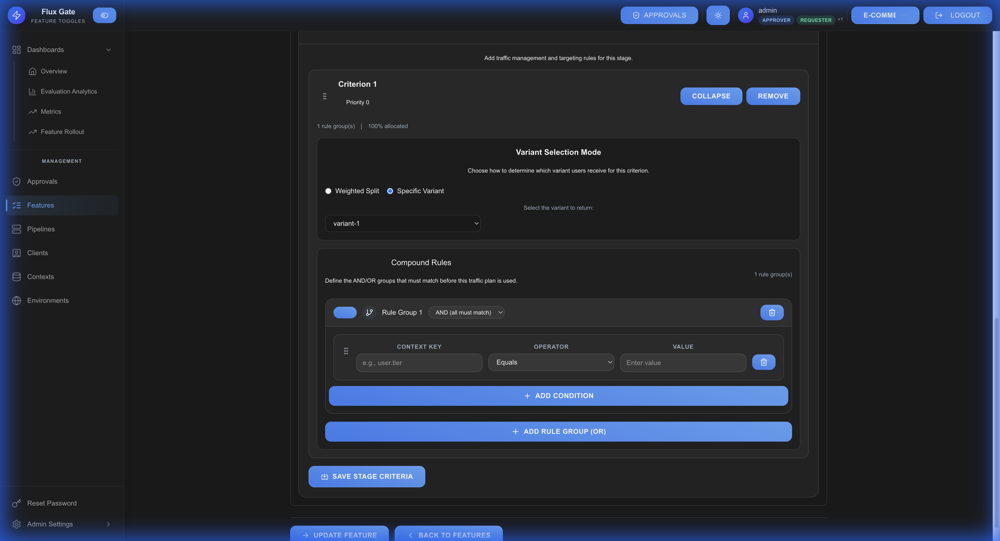
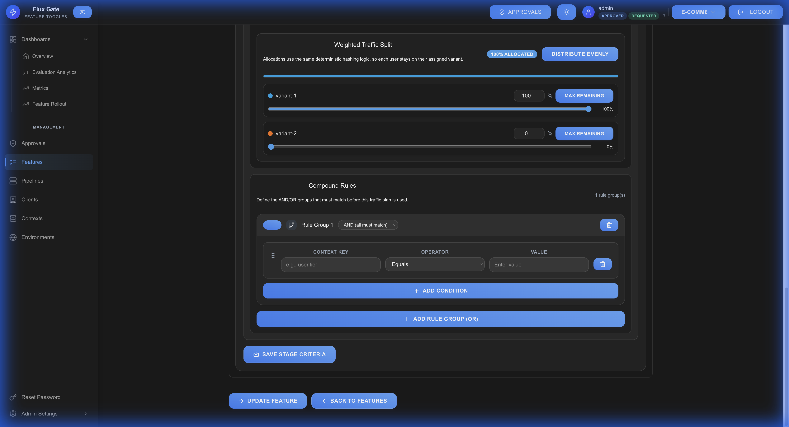

# Criteria

Criteria define targeting rules for contextual features, allowing you to control which users see which variants based on their attributes and context.

## Overview

Criteria enable precise audience segmentation and A/B testing by evaluating user context against defined rules. Each criterion can target specific user segments and assign them to feature variants.



## Creating Stage Criteria

### Step 1: Access Criteria Editor

1. Navigate to a contextual feature
2. Select a stage
3. Click **ADD CRITERION** button

### Step 2: Select Variant Mode

Choose how variants are assigned to matching users:



#### WEIGHTED_SPLIT (A/B Testing)
Distribute users across multiple variants with percentage-based allocation.

**Use Cases:**
- A/B testing new features
- Multi-variant experiments
- Gradual rollouts

**Example Configuration:**
- Control: 50%
- Variant A: 30%
- Variant B: 20%

#### SPECIFIC_VARIANT (Feature Gating)
Assign all matching users to a single variant.

**Use Cases:**
- VIP user features
- Geographic targeting
- Role-based access

**Example:**
- Premium users → "pro-features" variant
- All others → "control" variant

## Rule Groups

Rule groups define the conditions that users must meet to receive the criterion's variants.



### Logic Operators

**AND Logic**: All conditions must be true
```
User must be:
  - From United States AND
  - Have tier = "premium" AND
  - Age >= 25
```

**OR Logic**: At least one condition must be true
```
User can be:
  - From Canada OR
  - From United States OR
  - From United Kingdom
```

### Condition Structure

| Field | Description | Example |
|-------|-------------|---------|
| **Context Key** | User attribute to check | `country`, `userTier`, `age` |
| **Operator** | Comparison method | `EQUALS`, `IN`, `GREATER_THAN` |
| **Value** | Expected value | `"US"`, `["pro", "enterprise"]`, `25` |

## Available Operators

| Operator | Description | Value Type | Example |
|----------|-------------|------------|---------|
| `EQUALS` | Exact match | String, Number | `country EQUALS "US"` |
| `NOT_EQUALS` | Not equal | String, Number | `tier NOT_EQUALS "free"` |
| `IN` | Value in list | Array | `country IN ["US", "CA", "UK"]` |
| `NOT_IN` | Value not in list | Array | `tier NOT_IN ["trial", "suspended"]` |
| `GREATER_THAN` | Numeric comparison | Number | `age GREATER_THAN 18` |
| `GREATER_THAN_OR_EQUAL` | Numeric comparison | Number | `purchases GREATER_THAN_OR_EQUAL 1` |
| `LESS_THAN` | Numeric comparison | Number | `loginCount LESS_THAN 10` |
| `LESS_THAN_OR_EQUAL` | Numeric comparison | Number | `age LESS_THAN_OR_EQUAL 65` |
| `CONTAINS` | Substring match | String | `email CONTAINS "@company.com"` |
| `STARTS_WITH` | Prefix match | String | `userId STARTS_WITH "admin_"` |
| `ENDS_WITH` | Suffix match | String | `email ENDS_WITH ".edu"` |
| `REGEX` | Regular expression | String (regex pattern) | `phone REGEX "^\\+1"` |
| `SEMVER` | Semantic version | String (version range) | `appVersion SEMVER ">=2.0.0 <3.0.0"` |

## Variant Allocation

When using **WEIGHTED_SPLIT** mode, configure how traffic is distributed across variants.



### Configuration

Use sliders or numeric input to set percentages:
- Allocations must total ≤ 100%
- Unallocated percentage goes to default/control
- Changes take effect immediately

### Common Patterns

**50/50 A/B Test:**
- Control: 50%
- Variant A: 50%

**Multi-Variant Test:**
- Control: 33%
- Variant A: 33%
- Variant B: 34%

**Gradual Rollout:**
- Control: 95%
- New feature: 5% (increase over time)

## Criterion Examples

### Example 1: Premium Users Get Express Checkout

**Goal**: Enable express checkout for Pro and Enterprise users

**Configuration:**
- **Variant Mode**: SPECIFIC_VARIANT → `express-checkout`
- **Rule Group** (AND):
  - `userTier IN ["pro", "enterprise"]`

**Result**: All Pro/Enterprise users get express checkout (100%)

---

### Example 2: A/B Test for US Users

**Goal**: Test new checkout with US users (50/50 split)

**Configuration:**
- **Variant Mode**: WEIGHTED_SPLIT
  - Control: 50%
  - New checkout: 50%
- **Rule Group** (AND):
  - `country EQUALS "US"`

**Result**: US users split evenly between old and new checkout

---

### Example 3: Mobile Users in Canada

**Goal**: Show mobile-optimized UI to Canadian mobile users

**Configuration:**
- **Variant Mode**: SPECIFIC_VARIANT → `mobile-ui`
- **Rule Group** (AND):
  - `country EQUALS "CA"`
  - `deviceType EQUALS "mobile"`

**Result**: Canadian mobile users see optimized UI

---

### Example 4: Beta Features for Internal Users

**Goal**: Enable beta features for company employees or beta testers

**Configuration:**
- **Variant Mode**: SPECIFIC_VARIANT → `beta`
- **Rule Group** (OR):
  - `email ENDS_WITH "@company.com"`
  - `betaTester EQUALS true`

**Result**: Internal employees and beta testers get new features

---

## Priority-Based Evaluation

Criteria are evaluated in priority order (ascending). The **first matching criterion** determines the variant.

### Priority Order

| Priority | Target | Variant | Weight |
|----------|--------|---------|--------|
| **0** | Internal users | beta | 100% |
| **1** | Pro users | express-checkout | 100% |
| **2** | US users | A/B test | 50/50 |
| **3** | Everyone else | control | 100% |

### Evaluation Flow

1. Edge server receives evaluation request
2. Iterates through criteria by priority (0, 1, 2...)
3. For each criterion:
   - Checks if rule groups match
   - If match: applies variant selection
   - Returns variant and **stops evaluation**
4. If no match: returns default/control variant

### Reordering Criteria

Drag and drop the grip icon (☰) to reorder criteria. Priority numbers update automatically.

**Example:**
- User A (`admin@company.com`, tier: free) → Priority 0 matches → beta
- User B (tier: pro, country: CA) → Priority 1 matches → express-checkout
- User C (tier: free, country: US) → Priority 2 matches → 50% control, 50% new
- User D (tier: free, country: FR) → Priority 3 matches → control

## Saving and Testing

### Save Criteria

1. Click **SAVE STAGE CRITERIA** button
2. Backend validates configuration
3. Updated criteria pushed to edge servers via gRPC
4. Changes take effect immediately

### Validation

The system validates:
- Total allocations ≤ 100%
- All variant controls exist
- Valid operators and context keys
- Proper condition structure

### Testing Evaluation

Test targeting with the Edge Server evaluation API or SDK:

```bash
curl -X POST http://localhost:8081/evaluate \
  -H "Content-Type: application/json" \
  -d '{
    "features": ["checkout-redesign"],
    "context": {
      "userId": "user123",
      "userTier": "pro",
      "country": "US"
    }
  }'
```

**Response:**
```json
{
  "checkout-redesign": {
    "enabled": true,
    "variant": "express-checkout",
    "reason": "RULE_MATCH"
  }
}
```

## Best Practices

**Start Simple**: Begin with single-condition rules and expand as needed

**Use Priority Wisely**: Place most specific rules first, generic rules last

**Test Thoroughly**: Validate rules with sample contexts before production

**Monitor Analytics**: Track criterion match rates to ensure proper targeting

**Document Rules**: Add clear descriptions explaining targeting logic

**Minimize Complexity**: Avoid deeply nested OR/AND combinations

**Use Appropriate Operators**: Choose the most efficient operator (e.g., `IN` vs multiple `EQUALS`)

---

[← Features](Features) | [Home](Home) | [Next: Pipelines →](Pipelines)
