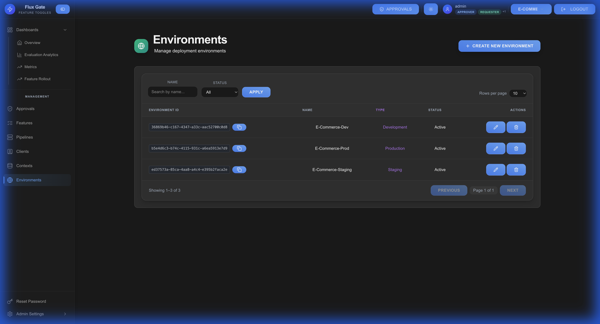

# Environments

Environments represent different deployment contexts where features are evaluated and tested (e.g., development, staging, production).

## Overview

Environments allow you to manage feature flags across different deployment stages with environment-specific configurations.

## Environment Configuration

| Field | Description | Example |
|-------|-------------|---------|
| **Environment Key** | Unique identifier | `production`, `staging`, `dev` |
| **Name** | Display name | "Production", "Staging" |
| **Description** | Purpose and context | "Live production environment" |
| **Color** | UI color coding | Blue, Green, Red |
| **Order** | Display order | 1, 2, 3 |

## Creating an Environment

1. Navigate to **Environments** → **Create Environment**
2. Enter environment details:
   - **Key**: Unique identifier (lowercase, no spaces)
   - **Name**: Display name
   - **Description**: Environment purpose
   - **Color**: Visual indicator
3. Save the environment

### Common Environments

**Development** (`dev`)
- Purpose: Feature development and initial testing
- Approvals: None required
- Sync Frequency: Real-time

**Staging** (`staging`)
- Purpose: Pre-production validation
- Approvals: Peer review
- Sync Frequency: Frequent

**QA** (`qa`)
- Purpose: Quality assurance testing
- Approvals: QA team lead
- Sync Frequency: Scheduled

**Production** (`production`)
- Purpose: Live user-facing deployment
- Approvals: Strict (2+ approvals)
- Sync Frequency: Controlled releases

## Environment-Specific Features

### Per-Environment Configuration

Features can have different configurations per environment:

- **Enabled State**: ON in production, OFF in staging
- **Targeting Rules**: Different criteria per environment
- **Variant Allocation**: Conservative in prod (5%), aggressive in dev (50%)
- **Kill Switch**: Environment-specific emergency disable

### Environment Isolation

Each environment maintains separate state:
- Independent feature evaluations
- Isolated analytics and metrics
- Separate approval workflows
- Environment-specific users/contexts

## Environment Management

### Updating Environments

1. Navigate to environment details
2. Modify configuration fields
3. Save changes
4. Features using this environment update automatically

### Deleting Environments

⚠️ **Warning**: Deleting an environment affects all features using it.

1. Ensure no active features depend on environment
2. Navigate to environment settings
3. Click **DELETE** button
4. Confirm deletion

## Environment Variables

Environments can store configuration variables accessible to features:

- **API Endpoints**: Environment-specific URLs
- **Feature Flags**: Default states
- **Thresholds**: Environment-specific limits
- **Secrets**: Encrypted configuration values

## Best Practices

**Naming Convention**: Use consistent, clear names (`dev`, `staging`, `prod`)

**Color Coding**: Use colors to quickly identify environments (Green = Safe, Red = Production)

**Mirror Production**: Keep staging environment similar to production

**Limit Access**: Restrict production environment changes to authorized users

**Document Purpose**: Add clear descriptions explaining each environment's role

**Clean Up**: Remove unused environments to keep system organized

---

[← Pipelines](Pipelines) | [Home](Home) | [Next: Approvals →](Approvals)
