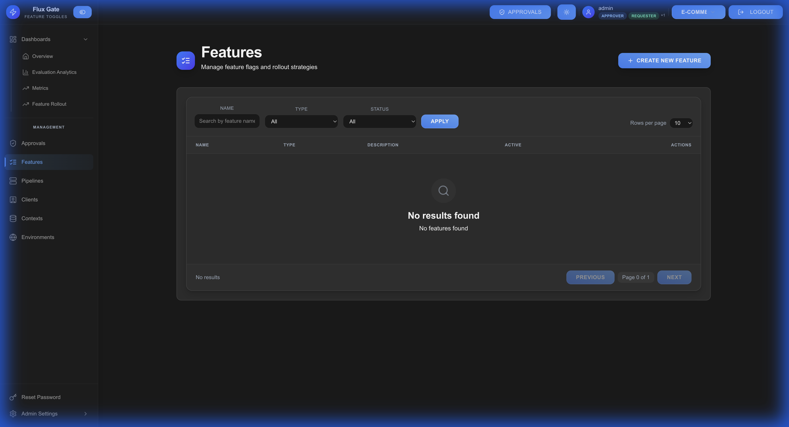
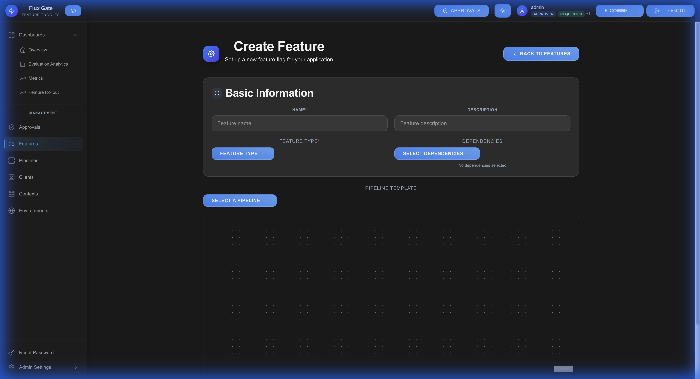

# Features

Features (or feature flags) are the core building blocks of FluxGate. They allow you to control feature rollout, run A/B tests, and manage feature lifecycles across environments.

## Features List

Access the features list from the main navigation. This page shows all feature flags in your system.



## Creating a Feature

Click the **CREATE FEATURE** button to open the feature creation form.



### Basic Information

| Field | Description | Example |
|-------|-------------|---------|
| **Feature Key** | Unique identifier | `checkout-redesign` |
| **Name** | Display name | "Checkout Redesign" |
| **Description** | Purpose and goals | "New streamlined checkout flow" |
| **Type** | Feature type | On/Off or Contextual |
| **Lifecycle Stage** | Current state | Active, Beta, Deprecated, Permanent |

### Feature Types

#### On/Off Features
Simple boolean flags that are either enabled or disabled for all users.

**Use cases:**
- Rolling out new features to all users
- Enabling/disabling system components
- Circuit breakers and emergency switches

#### Contextual Features
Advanced features with targeting rules and variant support for A/B testing.

**Use cases:**
- Gradual rollouts to specific user segments
- A/B testing with multiple variants
- Personalized experiences based on user attributes

## Feature Variants

Variants enable A/B testing by defining different versions of a feature.

### Variant Configuration

| Field | Description | Example |
|-------|-------------|---------|
| **Control** | Unique variant ID | `control`, `variant-a` |
| **Value** | Returned value | `false`, `true`, `"new-ui"` |
| **Value Type** | Data type | STRING, NUMBER, BOOLEAN, JSON |
| **Description** | Variant purpose | "Original experience" |

### Variant Types

**STRING**: Text values
```json
{"control": "variant-a", "value": "blue-theme"}
```

**NUMBER**: Numeric values
```json
{"control": "variant-b", "value": 50}
```

**BOOLEAN**: True/false flags
```json
{"control": "control", "value": false}
```

**JSON**: Complex objects
```json
{"control": "variant-c", "value": {"theme": "dark", "layout": "grid"}}
```

## Feature Stages

Features are organized into stages, each mapped to one or more environments.

### Stage Configuration

- **Stage Name**: Logical grouping (e.g., "Development", "Production")
- **Environment Mapping**: Which environments use this stage
- **Enabled**: Stage activation toggle
- **Auto-Rollback**: Scheduled automatic rollback
- **Kill Switch**: Emergency disable

### Lifecycle Stages

| Stage | Purpose | Use Case |
|-------|---------|----------|
| **Active** | In production use | Standard features |
| **Beta** | Testing with subset | New experimental features |
| **Deprecated** | Marked for removal | Legacy features being phased out |
| **Permanent** | Long-term feature | Paid tier features, core functionality |

## Feature Workflows

### Enabling a Feature

1. Navigate to the Features list
2. Locate the feature
3. Toggle the enable/disable switch
4. If approval policies are configured, submit for approval

### Updating Features

1. Click on the feature name to open details
2. Modify targeting rules or variant allocations
3. Update stage configuration
4. Save changes (may require approval)

### Kill Switch

Emergency feature disable for critical issues:

1. Open feature details
2. Click **"Activate Kill Switch"**
3. Optionally schedule auto-rollback
4. Feature immediately disabled across all edge servers

**Auto-Rollback**: Set a future date/time to automatically re-enable the feature after the issue is resolved.

## Variant Allocation

Control how users are distributed across variants:

### Weighted Distribution
Define percentage allocation for each variant:
- **Control**: 50%
- **Variant A**: 30%
- **Variant B**: 20%

### Sticky Assignment
Users consistently receive the same variant across sessions. This ensures:
- Accurate A/B test results
- Consistent user experience
- Reliable analytics

## Best Practices

**Use Descriptive Keys**: Feature keys should be clear and consistent (e.g., `checkout-redesign`, `new-dashboard`)

**Document Variants**: Add meaningful descriptions to all variants explaining what they do

**Start Small**: Begin with contextual rollouts to small user segments before full deployment

**Monitor Analytics**: Track evaluation metrics to measure variant performance

**Clean Up**: Archive or delete unused features to keep the system organized

**Plan Lifecycle**: Define clear stages for features from beta through deprecation

---

[← Back to Home](Home) | [Getting Started](Getting-Started) | [Next: Criteria →](Criteria)
