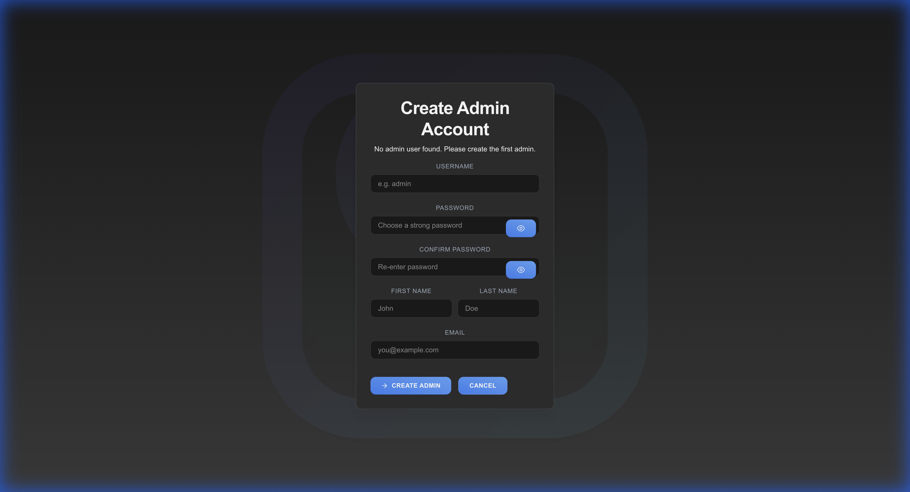
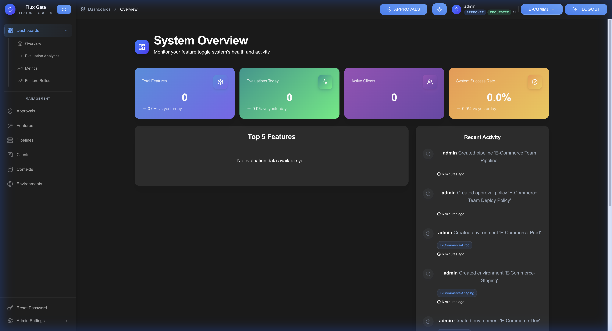

# Getting Started

This guide will help you set up and start using FluxGate for feature flag management.

## Prerequisites

1. **Kubernetes Cluster**: Access to a running Kubernetes cluster
   ```bash
   kubectl cluster-info
   ```

2. **kubectl**: Kubernetes command-line tool installed
   ```bash
   kubectl version
   ```

3. **Kustomize** (optional, built into kubectl 1.14+):
   ```bash
   # macOS
   brew install kustomize
   
   # Linux
   curl -s "https://raw.githubusercontent.com/kubernetes-sigs/kustomize/master/hack/install_kustomize.sh" | bash
   ```

4. **NGINX Ingress Controller** (if using ingress):
   ```bash
   kubectl apply -f https://raw.githubusercontent.com/kubernetes/ingress-nginx/controller-v1.8.1/deploy/static/provider/cloud/deploy.yaml
   ```

## Quick Start

### 1. Deploy FluxGate to Kubernetes

FluxGate uses Kustomize for environment-specific deployments. Choose your target environment:

**Development Environment** (1 replica, minimal resources):
```bash
kubectl apply -k k8s/overlays/dev
```

**Staging Environment** (3 backend replicas with clustering):
```bash
kubectl apply -k k8s/overlays/staging
```

**Production Environment** (3-5 replicas, production-ready):
```bash
kubectl apply -k k8s/overlays/production
```

### 2. Verify Deployment

Check that all pods are running:

```bash
# Check pod status
kubectl get pods -n fluxgate

# Expected output:
# NAME                               READY   STATUS    RESTARTS   AGE
# fluxgate-backend-xxxxx             1/1     Running   0          2m
# fluxgate-edge-xxxxx                1/1     Running   0          2m
# fluxgate-ui-xxxxx                  1/1     Running   0          2m
```

Check services:

```bash
kubectl get svc -n fluxgate
```

### 3. Access the UI

FluxGate is accessed through NGINX Ingress with the following default hostnames:

```bash
# Check ingress configuration
kubectl get ingress -n fluxgate

# Expected output shows three hosts:
# fluxgate.example.com      → UI
# api.fluxgate.example.com  → Backend REST API
# edge.fluxgate.example.com → Edge evaluation service
```

**Configure DNS or Hosts File:**

For local testing, add these entries to your `/etc/hosts` file:

```
<INGRESS_IP>  fluxgate.example.com
<INGRESS_IP>  api.fluxgate.example.com
<INGRESS_IP>  edge.fluxgate.example.com
```

Get the ingress IP address:
```bash
kubectl get ingress fluxgate -n fluxgate -o jsonpath='{.status.loadBalancer.ingress[0].ip}'
```

**Access the UI:**

Open your browser and navigate to:
```
http://fluxgate.example.com
```

For production deployments, configure your DNS provider to point these domains to your Kubernetes ingress controller's load balancer IP.

**TLS Configuration:**

The ingress supports TLS with the `fluxgate-tls` secret. To use HTTPS:
- Update the TLS certificate in `k8s/base/tls-secret.yaml`
- Access via `https://fluxgate.example.com`


### 4. Initial Setup

**First-Time Setup:**

When you first access FluxGate, you'll be redirected to the admin creation page:

```
http://fluxgate.example.com/create-admin
```



Create your initial administrator account:
- **Username**: Choose a unique username
- **Password**: Strong password (min 8 characters)
- **Confirm Password**: Re-enter password
- **First Name**: Your first name
- **Last Name**: Your last name
- **Email**: Your admin email address

Click **CREATE ADMIN** to set up your account.

**Subsequent Logins:**

After the initial admin is created, access the login page:

```
http://fluxgate.example.com/login
```


Enter your credentials and click **LOGIN** to access the system.

### 5. System Overview

After logging in, you'll see the main dashboard with system statistics and quick access to key features.



The dashboard displays:
- **Total Features**: Number of feature flags in the system
- **Active Features**: Currently enabled features
- **Evaluations (24h)**: Feature evaluations in the last 24 hours
- **Quick Actions**: Create features, view approvals, access analytics

## Deployment Configuration

### Environment-Specific Settings

Each environment overlay (`dev`, `staging`, `production`) provides different configurations:

| Environment | Backend Replicas | Edge Replicas | Clustering | Image Tag |
|-------------|------------------|---------------|------------|-----------|
| **Development** | 1 | 1 | Disabled | `latest` |
| **Staging** | 3 | 1 | Enabled | Versioned |
| **Production** | 3 | 5 | Enabled | Versioned |

### Service Endpoints

Once deployed, the following services are available within the cluster:

- **Backend REST API**: `fluxgate-backend:8080`
- **Backend gRPC**: `fluxgate-backend:50051`
- **Edge Server**: `fluxgate-edge:8081`
- **UI**: `fluxgate-ui:80`

### External Access

Configure ingress hosts in `k8s/base/ingress.yaml`:

- **UI**: `fluxgate.example.com`
- **Backend API**: `api.fluxgate.example.com`
- **Edge Server**: `edge.fluxgate.example.com`

## Managing the Deployment

### View Logs

```bash
# Backend logs
kubectl logs -f deployment/fluxgate-backend -n fluxgate

# Edge server logs
kubectl logs -f deployment/fluxgate-edge -n fluxgate

# UI logs
kubectl logs -f deployment/fluxgate-ui -n fluxgate
```

### Scale Services

```bash
# Scale edge servers for high traffic
kubectl scale deployment/fluxgate-edge -n fluxgate --replicas=10

# Or update kustomization and reapply
kubectl apply -k k8s/overlays/production
```

### Update Configuration

1. Edit configuration in `k8s/overlays/<environment>/kustomization.yaml`
2. Apply changes:
   ```bash
   kubectl apply -k k8s/overlays/production
   ```
3. Restart pods if needed:
   ```bash
   kubectl rollout restart deployment/fluxgate-backend -n fluxgate
   ```

### Delete Deployment

```bash
# Delete specific environment
kubectl delete -k k8s/overlays/dev

# Or delete the entire namespace
kubectl delete namespace fluxgate
```

## Next Steps

- **[Create your first feature](Features#creating-a-feature)** - Learn how to create feature flags
- **[Configure targeting rules](Criteria)** - Set up audience segmentation
- **[Set up pipelines](Pipelines)** - Automate deployment workflows
- **[Configure approval policies](Approval-Policies)** - Add governance to feature changes

## User Roles

FluxGate supports three user roles:

| Role | Permissions |
|------|-------------|
| **Requester** | Create features, submit changes, view analytics |
| **Approver** | All Requester permissions + approve/reject changes |
| **Team Admin** | All permissions including user/team management and system settings |

The default `admin` user has **Team Admin** role with full system access.

## Troubleshooting

**Issue**: Pods not starting  
**Solution**: Check pod status and logs:
```bash
kubectl describe pod <pod-name> -n fluxgate
kubectl logs <pod-name> -n fluxgate
```

**Issue**: Cannot access UI  
**Solution**: Verify service and ingress configuration:
```bash
kubectl get svc -n fluxgate
kubectl get ingress -n fluxgate
```

**Issue**: Backend database connection errors  
**Solution**: Check database secret configuration:
```bash
kubectl get secret fluxgate-db -n fluxgate -o yaml
```

**Issue**: Configuration changes not taking effect  
**Solution**: Restart the affected deployment:
```bash
kubectl rollout restart deployment/fluxgate-backend -n fluxgate
```

For detailed Kubernetes configuration documentation, see the `k8s/KUSTOMIZE_README.md` file in the project repository.

---

[← Back to Home](Home) | [Next: Features →](Features)
