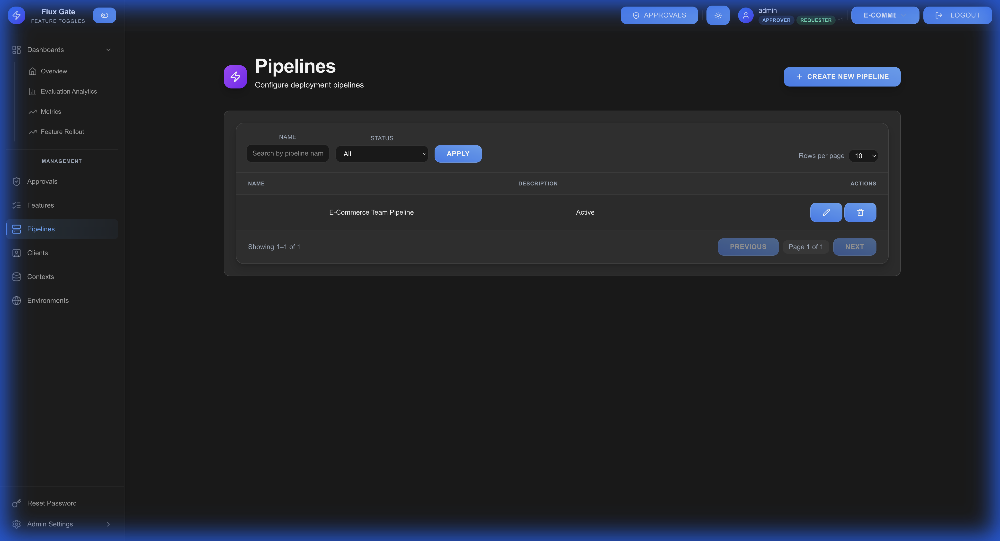

# Pipelines

Pipelines automate feature flag deployment across environments, ensuring controlled and repeatable rollout workflows.

## Overview

Deployment pipelines define the promotion path for features from development through production. They enforce stage-based progression and integrate with approval workflows.



## Pipeline Structure

A pipeline consists of ordered stages, each mapped to one or more environments:

```
Development → Staging → Production
```

### Pipeline Configuration

| Field | Description | Example |
|-------|-------------|---------|
| **Pipeline Name** | Unique identifier | "Standard Deployment" |
| **Description** | Pipeline purpose | "Dev → Staging → Prod workflow" |
| **Stages** | Ordered deployment stages | Development, Staging, Production |
| **Environment Mapping** | Which environments use each stage | Dev → dev, Staging → staging, Production → prod |

## Creating a Pipeline

1. Navigate to **Pipelines** → **Create Pipeline**
2. Enter pipeline name and description
3. Define stages in deployment order
4. Map each stage to environment(s)
5. Save the pipeline

### Example Pipeline

**Name**: "Standard Release Pipeline"

**Stages:**
1. **Development**
   - Environments: `dev`, `local`
   - Purpose: Initial feature development and testing

2. **Staging**
   - Environments: `staging`, `qa`
   - Purpose: Pre-production validation and QA

3. **Production**
   - Environments: `production`
   - Purpose: Live user-facing deployment

## Deploying Features

### Promotion Workflow

1. **Create Feature** in early pipeline stage
2. **Test and Validate** in current environment
3. **Promote** to next pipeline stage
4. **Submit for Approval** (if policies configured)
5. **Deployment** after approval
6. **Monitor** feature performance

### Promotion Methods

**Manual Promotion:**
1. Navigate to feature details
2. Click **PROMOTE** button
3. Select target stage
4. Submit for approval (if required)
5. Changes deploy after approval

**Automated Promotion:**
- Configure auto-promotion rules
- Time-based progression
- Metric-based triggers (e.g., success rate thresholds)

## Pipeline States

### Stage Status

**Pending**: Awaiting deployment or approval  
**Active**: Currently deployed in this stage  
**Promoting**: In progress to next stage  
**Failed**: Deployment error occurred  
**Rolled Back**: Reverted to previous version

## Approval Integration

Pipelines integrate with approval policies to enforce governance:

- **Development**: No approval required (fast iteration)
- **Staging**: Peer review (1 approval)
- **Production**: Strict control (2 approvals)

See [Approval Policies](Approval-Policies) for configuration details.

## Rollback

If issues arise, rollback to previous stage:

1. Open feature in problematic stage
2. Click **ROLLBACK** button
3. Confirm rollback action
4. Feature reverts to previous stage configuration

### Auto-Rollback

Configure automatic rollback based on:
- **Time**: Revert after X hours
- **Metrics**: Trigger rollback if error rate exceeds threshold
- **Manual Trigger**: Emergency kill switch activation

## Best Practices

**Mirror Production**: Make staging environment as close to production as possible

**Test Thoroughly**: Validate features completely before promoting

**Small Changes**: Promote incremental changes to minimize risk

**Monitor Metrics**: Watch analytics during and after promotion

**Plan Rollbacks**: Have rollback strategy before production deployment

**Use Approval Policies**: Enforce reviews for production changes

**Document Promotions**: Add notes explaining why features are promoted

---

[← Criteria](Criteria) | [Home](Home) | [Next: Environments →](Environments)
