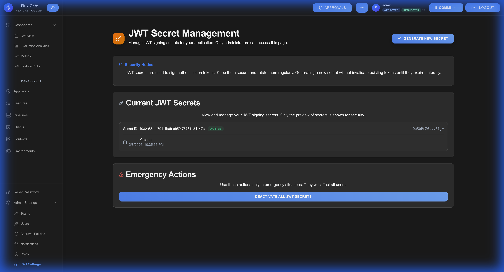
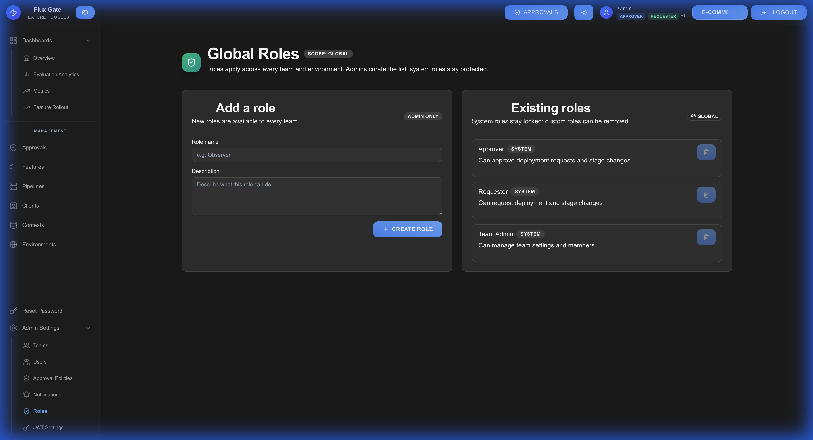

# Settings

System settings configure FluxGate's security, notifications, and authentication mechanisms.

## Overview

Settings provide centralized configuration for JWT authentication, notification preferences, role management, and system-wide parameters.

## JWT Settings

Configure JSON Web Token authentication parameters.



### JWT Configuration

| Setting | Description | Default | Recommended |
|---------|-------------|---------|-------------|
| **Secret Key** | Token signing key | Auto-generated | Rotate periodically |
| **Token Expiry** | Token lifetime | 24 hours | 8-24 hours |
| **Refresh Enabled** | Auto-refresh tokens | Yes | Yes |
| **Issuer** | JWT issuer claim | FluxGate | Your organization |
| **Audience** | JWT audience claim | FluxGate UI | Your application |

### Updating JWT Settings

1. Navigate to **Settings** → **JWT Settings**
2. Modify configuration:
   - Token expiry duration
   - Signing algorithm
   - Issuer and audience claims
3. Click **SAVE**
4. Active sessions remain valid until expiry

⚠️ **Warning**: Changing secret key invalidates all active sessions.

## Notifications

Configure system notifications for approvals, feature changes, and alerts.


### Notification Channels

**In-App Notifications:**
- Real-time UI notifications
- Dashboard badge counters
- Notification history

**Email Notifications:**
- Approval requests
- Feature change alerts
- System announcements
- Digest summaries

**Webhook Notifications:**
- POST to external URLs
- Custom payload format
- Retry logic for failures
- Signature verification

### Notification Events

Configure notifications for:

| Event | Description | Default |
|-------|-------------|---------|
| **Approval Requested** | New approval needed | Email + In-App |
| **Approval Approved** | Request approved | In-App |
| **Approval Rejected** | Request rejected | Email |
| **Feature Created** | New feature added | In-App |
| **Feature Updated** | Feature modified | In-App |
| **Feature Deleted** | Feature removed | Email |
| **Kill Switch Activated** | Emergency disable | Email + In-App |
| **Deployment Failed** | Promotion error | Email |

### Email Configuration

**SMTP Settings:**
```
Host: smtp.example.com
Port: 587
Username: notifications@example.com
Password: ********
From Address: noreply@fluxgate.example.com
```

**Email Templates:**
- Customize email subject and body
- Include dynamic variables
- Add branding and logos

## Roles

Manage and configure user roles and permissions.



### Role Configuration

Navigate to **Settings** → **Roles** to:

- **View Roles**: See all system roles
- **Edit Permissions**: Modify role capabilities
- **Create Custom Roles**: Define organization-specific roles
- **Role Hierarchy**: Set role precedence

### Permission Categories

**Feature Management:**
- Create features
- Update features
- Delete features
- View features

**Approval Workflow:**
- Submit requests
- Approve requests
- Reject requests
- Override approvals

**Administration:**
- Manage users
- Manage teams
- Configure settings
- View audit logs

**Analytics:**
- View metrics
- Export data
- Create reports

## System Configuration

### General Settings

**System Name**: FluxGate  
**Base URL**: http://localhost:8090  
**Timezone**: UTC (configurable)  
**Date Format**: YYYY-MM-DD  
**Time Format**: 24-hour

### Security Settings

**Password Policy:**
- Minimum length: 8 characters
- Complexity requirements: Yes
- Password expiry: 90 days (optional)
- Failed login attempts: 5 (lockout after)

**Session Management:**
- Session timeout: 24 hours
- Concurrent sessions: Allowed
- Remember me: 30 days

**API Security:**
- Rate limiting: 1000 requests/hour
- CORS origins: Configurable
- API key rotation: Required every 90 days

### Audit Logging

**Logged Events:**
- User logins and logouts
- Feature modifications
- Approval decisions
- Setting changes
- API access

**Log Retention:**
- Default: 90 days
- Configurable retention period
- Export capability
- Compliance reporting

## Backup and Restore

**Automated Backups:**
- Frequency: Daily
- Retention: 30 days
- Backup location: Configurable
- Encryption: AES-256

**Manual Backup:**
1. Navigate to **Settings** → **Backup**
2. Click **CREATE BACKUP**
3. Download backup file
4. Store securely

**Restore:**
1. Navigate to **Settings** → **Restore**
2. Upload backup file
3. Confirm restoration
4. System restarts with restored state

## Best Practices

**Regular Backups**: Schedule automated daily backups

**Rotate Secrets**: Change JWT secret keys periodically

**Monitor Logs**: Review audit logs regularly

**Secure Credentials**: Use environment variables for sensitive data

**Test Notifications**: Verify notification delivery before production

**Document Changes**: Log all configuration modifications

**Review Permissions**: Audit role permissions quarterly

---

[← Users](Users) | [Home](Home)
