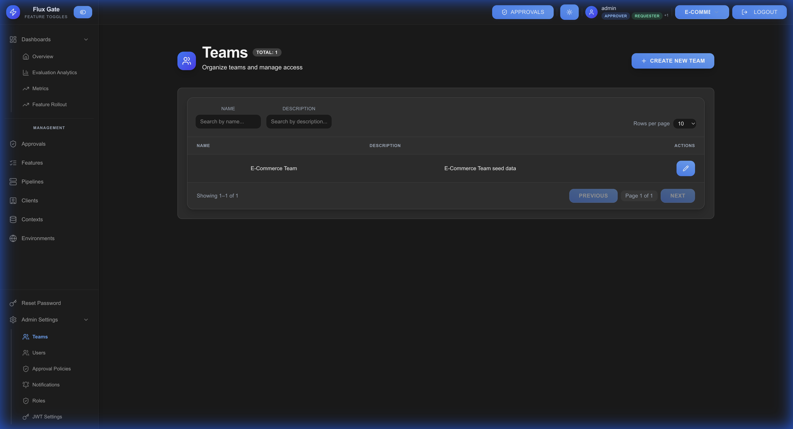

# Teams

Teams organize users into collaborative groups for managing feature flags and controlling access.

## Overview

Teams enable collaboration and access control by grouping users who work together on features.

## Team Structure

| Field | Description | Example |
|-------|-------------|---------|
| **Team Name** | Unique identifier | "Engineering", "Product" |
| **Description** | Team purpose | "Core engineering team" |
| **Members** | Team users | Users with assigned roles |
| **Features** | Team-owned features | Feature flags managed by team |

## Creating a Team

1. Navigate to **Teams** → **Create Team**
2. Enter team details:
   - **Name**: Team identifier
   - **Description**: Team purpose and scope
3. Click **CREATE**
4. Add team members

## Team Permissions

Teams can have environment-specific permissions:

| Permission | Description |
|------------|-------------|
| **Read** | View features and configurations |
| **Write** | Create and modify features |
| **Delete** | Remove features |
| **Approve** | Approve feature changes | **Admin** | Full team management |

## Adding Team Members

1. Open team details
2. Click **ADD MEMBER**
3. Select user from list
4. Assign role:
   - **Member**: Standard access
   - **Lead**: Team leadership
   - **Admin**: Full team control
5. Click **ADD**

## Team-Based Features

Features can be assigned to teams:

- **Ownership**: Clear responsibility
- **Access Control**: Team-only visibility
- **Collaboration**: Shared feature management
- **Audit Trail**: Team-based change tracking

## Removing Members

1. Navigate to team details
2. Find member in list
3. Click **REMOVE** button
4. Confirm removal

## Deleting Teams

1. Ensure team has no active features
2. Remove all team members
3. Navigate to team settings
4. Click **DELETE**
5. Confirm deletion

## Best Practices

**Clear Naming**: Use descriptive team names (e.g., "iOS-Team", "Backend-Services")

**Define Ownership**: Assign features to specific teams

**Regular Review**: Audit team membership periodically

**Role Clarity**: Ensure members have appropriate roles

**Document Purpose**: Add clear team descriptions

---

[← Clients](Clients) | [Home](Home) | [Next: Users →](Users)
