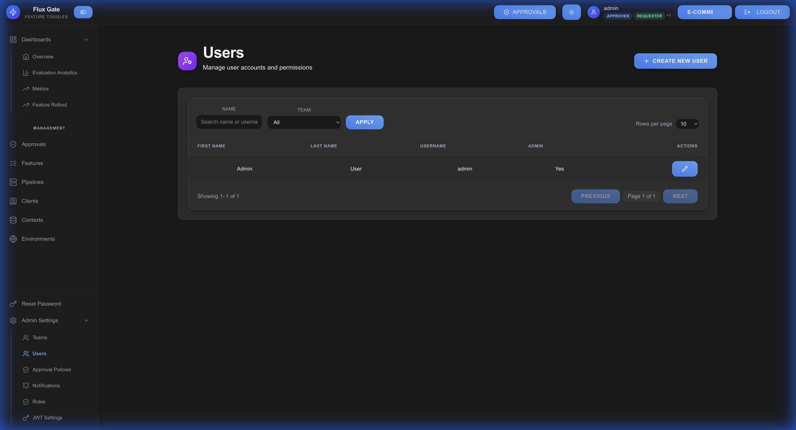

# Users

User management allows administrators to control access, assign roles, and manage permissions within FluxGate.

## Overview

Users represent individuals who access the FluxGate system. Each user has a role that determines their permissions.

## User Roles

FluxGate supports three primary roles:

### Requester
**Permissions:**
- View features and configurations
- Create new features
- Submit feature changes
- View analytics and metrics
- Approve others' requests (peer review)

**Cannot:**
- Approve own requests
- Manage users or teams
- Configure system settings

**Use Case:** Developers, product managers

---

### Approver
**Permissions:**
- All Requester permissions
- Review and approve/reject feature changes
- Add detailed approval comments
- Track approval metrics

**Cannot:**
- Manage users or teams
- Configure approval policies
- Modify system settings

**Use Case:** Engineering leads, release managers

---

### Team Admin
**Permissions:**
- All Approver permissions
- Manage users and teams
- Configure approval policies
- Modify system settings
- Override approvals (if configured)

**Use Case:** Team leads, system administrators

## Creating a User

1. Navigate to **Users** → **Create User**
2. Enter user details:
   - **Username**: Unique identifier
   - **Email**: User email address
   - **Name**: Full name
   - **Role**: Requester, Approver, or Team Admin
3. Set initial password
4. Click **CREATE**
5. User receives welcome email (if configured)

## User Management

### Updating User Information

1. Open user details
2. Modify fields:
   - Email address
   - Full name
   - Role assignment
3. Save changes

### Changing User Roles

1. Navigate to user settings
2. Select new role from dropdown
3. Confirm role change
4. User permissions update immediately

### Resetting Passwords

**Admin-Initiated Reset:**
1. Open user settings
2. Click **RESET PASSWORD**
3. Generate temporary password
4. Share with user securely

**Self-Service Reset:**
- Users can reset via login page
- Password reset link sent to email

### Deactivating Users

Instead of deleting, deactivate users to preserve audit history:

1. Open user settings
2. Toggle **ACTIVE** status to OFF
3. User cannot log in
4. Historical data preserved

### Deleting Users

⚠️ **Warning**: Deleting users removes them from audit trails.

1. Deactivate user first
2. Verify no active approvals or requests
3. Click **DELETE USER**
4. Confirm deletion

## User Activity

### Audit Trail

Track user actions:
- Feature creations and modifications
- Approval decisions
- Login history
- Setting changes

### Analytics

Monitor user engagement:
- Active users per day/week
- Feature evaluations by user
- Approval response times
- Most active contributors

## Authentication

### JWT Authentication

FluxGate uses JWT (JSON Web Token) for authentication:

- **Token Expiry**: Configurable (default: 24 hours)
- **Refresh Tokens**: Auto-renewal before expiry
- **Logout**: Invalidates current token

### Password Requirements

Default password policy:
- Minimum 8 characters
- At least one uppercase letter
- At least one lowercase letter
- At least one number

Administrators can customize requirements in [Settings](Settings).

## Best Practices

**Principle of Least Privilege**: Assign minimum necessary role

**Regular Audits**: Review user list and roles periodically

**Deactivate Promptly**: Disable accounts for departing team members

**Strong Passwords**: Enforce password complexity requirements

**Monitor Activity**: Track unusual user behavior

**Documentation**: Document role assignments and rationale

---

[← Teams](Teams) | [Home](Home) | [Next: Settings →](Settings)
